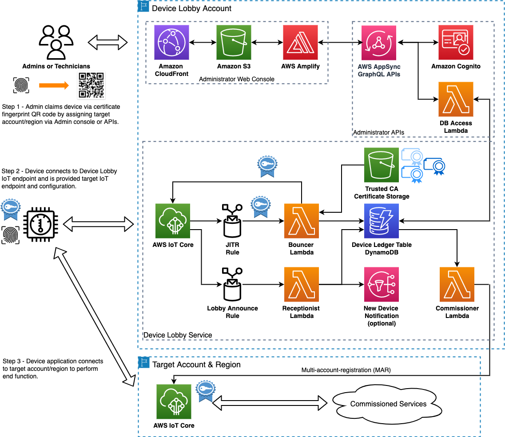

# Device Lobby Design
## Table of Contents

  - [Use cases for the Device Lobby](#use-cases-for-the-device-lobby)
  - [Architecture Overview](#architecture-overview)
  - [Tenets of the Device Lobby](#tenets-of-the-device-lobby)
  - [Service Components](#service-components)
    - [Device Lobby Ledger Table - DynamoDB](#device-lobby-ledger-table---dynamodb)
    - [Bouncer Lambda Function](#bouncer-lambda-function)
    - [Receptionist Lambda Function](#receptionist-lambda-function)
    - [Commissioner Lambda Function](#commissioner-lambda-function)
      - [Enabling trust with target accounts and the Commissioner Lambda](#enabling-trust-with-target-accounts-and-the-commissioner-lambda)
    - [Device Lobby Admin APIs and Web Portal](#device-lobby-admin-apis-and-web-portal)
  - [Design Background](#design-background)
  

## Device Onboarding Use Cases
1. **Commissioning of devices at time of install** where a technician or user installs the device and the customer account or region is not known until time of install or late binding of devices to accounts – i.e. technicians claiming devices at time of install using authorized mobile device/app.
2. **Offline commissioning of devices in the supply chain** where devices are drop shipped to a customer and need to “just work” when powered up. The customer account/region is known at time of shipment but the device is in a box and not powered on – offline binding in the supply chain.
3. **Account or region migration of previously fielded devices** where devices need to be moved among accounts/env/regions without changing credentials for factory returns/refurbishment/redeployment or simply moving devices during development between dev/staging/prod environments.
4. **Disaster recovery orchestration** where a given region becomes unavailable and devices need to be dynamically routed in the field to another account or region with functioning application infrastructure.
   
## Architecture Overview
Bootstrapping, Zero-Touch-Onboarding and Enrollment-Over-Secure-Transport (EST) are all peripheral terms that could be used to describe this system.  But for the sake of simplification, we relate the function of this service to that of the lobby of a building with the service components representing the personas one might encounter.  Hence the name, the Device Lobby.

Just as a physical lobby of a building or campus provides a public entry point for visitors, the IoT Device Lobby architecture establishes a secure entry point into cloud services for unbound IoT devices. The IoT Device Lobby enables flexible onboarding of devices though the claiming of device by users/administrators and subsequent routing of devices to a target IoT endpoints (account/region) without reprovisioning.  This allows device manufacturers to produce generic devices that can be easily bound to an end AWS account/region anywhere in the device lifecycle and effectively decouples the manufacturing and provisioning of devices from the end cloud services once deployed in the field.

## Tenets of the Device Lobby
- **Device identity is immutable, long-lived and cryptographically provable**
- **Fingerprint (SHA256 hash) of device certificate is the primary means for public identification**
- **Lobby address(es) can be provisioned at time of manufacturing or can be configured in the field**
- **Minimal device side commissioning logic in order to works with any type of device using MQTT and mTLS**
- **Compatible with 3rd party PKI**

## Service Components

### Device Lobby Ledger Table - DynamoDB

The ledger table acts as the data store for commissioning devices to specific accounts and regions.  It is accessed from both the device side through the receptionist function and through the administrative side using the APIs or example web portal.  As the certificate finger print is used to globally and cryptographically identify devices, it is used as the primary key for the ledger table.

When devices interact with the lobby service, the device identity is automatically captured and stored in the table.  The device identity consists of the following elements: 
- X.509 device certificate or chain
- thing name - extracted from the CN field of the device certificate
- device certificate fingerprint - derived from the cerificate itself
- config payload - optional payload published by the device to the lobby topic

From the administrative APIs or portal, the device fingerprint and status can be read and the target account/region can be written for commissioning devices. 

The following is an example of an entry in the ledger table:
[TODO] add sample DDB entry

### Bouncer Lambda Function

This function acts as the authorizer/authenticator for devices connecting to the lobby.  It is responsible for verifing the certificate chain presented by the device against one or more trusted root certificates.  It can be triggered using either Just-In-Time-Registration(JITR) or custom authorizer menthods.

With the JITR trigger, the root CA that directly signed the device certificate must be registered with IoT Core as described here.  Event messages must then be enabled for IoT Core.

[TODO] add sample auto reg message

Device requirements:  
- Unpack thingname from cert CN Subject and use as mqtt client id

With the custom authorizer triggering method, 
Device requirements:

If a presented cert chain can be verified as authenticate against one of the root certificates, the function then performs the following to enable the device to connect to the lobby service:
1) The device certificate is registered with IoT Core.
1) Thing name is extracted from the Common Name (CN) field of the certificate, registered with IoT Core, and attached to the certificate.
1) A device policy only enabling access to the lobby resources is created, registered with IoT Core, and attached to the cert.
1) The certificate fingerprint, thing name, device certificate and status are then entered into the device-lobby-ledge table in DynamoDB.

### Receptionist Lambda Function
Once a device connects to the lobby, it should extract its thing name from the CN field of the device cert and use it as the MQTT client id.  It then subscribes to its device specific lobby MQTT topic ( `lobby/<thingname>` ) and begins periodically publishing to the basic ingest topic ($aws/rules/lobby) that triggers the receptionist lambda.

The lobby rule uses the following SQL statement to pass certificate fingerprint (principal() function), device name (clientid() function) and any payload the device publishes to the receptionist lambda function:
` SELECT principal() AS certid, clientid() AS devicename, * `

The receptionist is responseble looking to see if an iot endpoint address exists for the device in the device-lobby table and publishes it back as a commissioning message to the device on its specific lobby topic ( `lobby/<thingname>`).  This commissioning message could optionally contain a configuration payload for the device.

If an iot endpoint address does not exist for the device in the ledger, no action is taken and the device can wait in the lobby.  The function updates the device status in the ledger indicating it is in the lobby and could optionally trigger a SNS message to notify someone that a device is waiting. 

### Commissioner Lambda Function
The commissioner's job is to watch the document event stream from the device lobby ledger table in DynamoDB and to register the devices in IoT Core in their target accounts and regions using Multi-Account-Registration(MAR)<link> as the devices are claimed/commissioned.  From fleet operator or lobby administrator perspecive, the commissioning process consists of writing the target account/region and the operational permissions the device needs in the target account to the ledge table using the device fingerprint as the primary key.  The permissions come in the form of an IoT device policy that the fleet operator could select during commissioning that is then used during registration of devices into their target accounts.

For the commissioning process in a target account to occur, both the commissioning and device identity data must exist in the ledger table.  So a device must have connected to the lobby at some point for the identity to be captured and commissioning data written by the admin.  However, these events can happen in any order and then enables flexibility in the onboarding process.  The device could connect to the lobby for some time and then be commissioned/claimed or the device fingerprint could be claimed/commissioned well before the device actually connects.  This enables both use cases for late binding devices to a service either at time of device install in the field or prior to a device ever being seen by the lobby while it may be in the supply chain in a powered-off state.

Since IoT Core endpoint addresses the devices use to connect are obfuscated (ex. <auuv869v9wcg7-ats.iot.us-west-2.amazonaws.com>) from the AWS account number, the commissioner is responsible for translating the AWS account number and region provided by an administrator in a device record into the associated IoT Core endpoint address for the target account.  

Once a complete commissioning record is available for a device, the commissioner lambda function will perform the following:
1) register the certificate with ca-less registration in IoT Core in the target account and region
1) register the thing name and attach to the certificate
1) register the operational device policy and attach to the certificate
1) activate the device certificate
1) fetch the IoT core endpoint address for the target account/region
1) write the IoT core endpoint address back to the device entry in the ledger table to complete the commissioning process

#### Enabling trust with target accounts and the Commissioner Lambda
Target accounts that will receive devices from the device lobby service are accessed by the commissioner lambda function using cross-account access <https://docs.aws.amazon.com/IAM/latest/UserGuide/id_roles_common-scenarios_aws-accounts.html>.  A trust relationship is established with the target account by enabling the commissioner lambda execution role in the lobby service account to assume a device-commissioner-role in the target account that grants the needed access for the commissioner to register devices into the account.  Managing the onboarding and listing of the target accounts could be managed using a separate interface web portal.

See the example policies and setup guide in the main repo.

### Device Lobby Admin APIs and Web Portal

Access to the device lobby ledger table in DynamoDB is provided through GraphQL APIs created in AWS AppSync.  These APIs restricted access to the ledger table and only provide the ability to read the device fingerprints and commissioning states to determine status and to write target accounts, regions and policies.  Erase access is intentially not provided for a given fingerprint entry in the ledger as it is intended to be an immutable registry for device interaction with the service.

The web application is created using Amplify and the react.js framework to provide a simple user interface for managing the routing of devices through the lobby.  The device registration interface includes an example QR code reader implementation for easy capture a fingerprint printed as a QR code on the device.  This enables a simple way for an installing technician to input the fingerprint of a device to be commissioned. 

