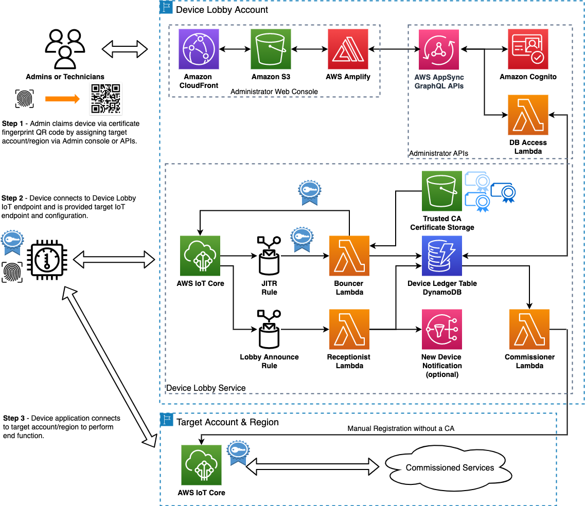
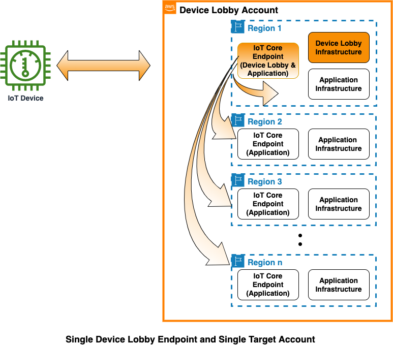
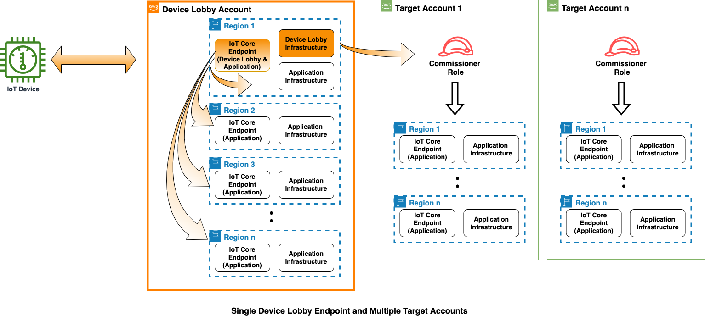
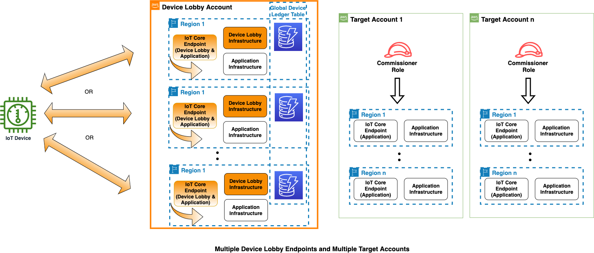

# IoT Device Lobby Architecture
This solution provides a method for QR code onboarding of devices to AWS IoT Core. It simplifies the provisioning and onboarding process of devices by removing the requirement that an end cloud account/region is known at the time of device provisioning in the factory.  This enables device makers to produce generic IoT devices not bound to end cloud services. IoT platform operators are then able to attach these devices to their services in the field in a flexible manner. 



Refer to the [DESIGN](DESIGN.md) doc for [USE CASES](DESIGN.md#device-onboarding-use-cases) and implementation details.

***Table of Contents:***
  - [Deployment Quickstart Guide](#deployment-quickstart-guide)
  - [Device Lobby Configuration](#device-lobby-configuration)
    - [Adding target AWS accounts and regions](#adding-target-aws-accounts-and-regions)
    - [Adding additional device signing CAs](#adding-additional-device-signing-cas)
  - [Implementaion Guidelines](#implementaion-guidelines)
    - [Device Manufacturer Guidelines](#device-manufacturer-guidelines)
    - [IoT Service Operator Guidelines](#iot-service-operator-guidelines)
    - [Building a Global Device Lobby Service](#building-a-global-device-lobby-service)
  - [Security](#security)
  - [License](#license)

## Deployment Quickstart Guide
### Step 1 - Setup a deployment environment in Cloud9

1. **Log in to the [AWS Account Console](https://console.aws.amazon.com).**
1. **[Create](https://console.aws.amazon.com/cloud9/home/create?) a Cloud9 environment with the following configuration:**
   - Name: **Device Lobby Deployment Env**
   - Environment type: **Create a new EC2 instance for environment (direct access)**
   - Instance type: **m5.large**
   - Platform: **Ubuntu Server 18.04 LTS**

### Step 2 - Deploy the Device Lobby Service infrastructure and Admin APIs.
1. **In the Cloud9 IDE terminal, update to AWS CLI v2, then clone the AWS Device Lobby repo:**
```
curl "https://awscli.amazonaws.com/awscli-exe-linux-x86_64.zip" -o "awscliv2.zip"
unzip awscliv2.zip
sudo ./aws/install
git clone https://github.com/aws-samples/aws-device-lobby
cd aws-device-lobby/
```

2. **Deploy the Device Lobby Service and Admin APIs with the included deploy script:**
```
./deploy.sh
```
This will deploy the service Lambda functions, device ledger DynamoDB table and the AppSync GraphQL APIs for claiming and routing devices.  Refer to the Device Lobby [CloudFormation template](CloudFormation-DeviceLobby-Account.yaml) for more details. 
When the deploy script finishes, the ARNs of the primary services elements are printed including the AppSync API ID and API key used for administering the Device Lobby service. 

### Step 3 - Deploy the Device Lobby Admin console web application.

---->[Follow the Device Lobby admin console quickstart.](admin-interface/admin-console#deployment-quickstart-guide)

### Step 4 - Setup the example public key infrastructure (PKI) and register the signing CA for your device certificates.

---->[Follow the PKI Quickstart](pki#pki-quickstart)

### Step 5 - Provision, connect and claim devices through the Device Lobby

---->[Follow the AWS IoT SDK v2 for Python Quickstart](device/aws-iot-python-sdkv2/README.md#quickstart)

Checkout the [device README](device/README.md) for other sample device implementations of Device Lobby onboarding.

***So what did we just build?*** 

At the end of this quickstart, you will be left with a **single device lobby endpoint** with a **single target account** that enables routing a device to any region (including the device lobby region) in that account as seen in the following diagram:


Read on for how target accounts can be added to the architecture.

## Device Lobby Configuration
### Adding target AWS accounts and regions
Additional ***target accounts*** can be added to the service by enabling trust from a role in the target account and the commissioner lambda execution role in the account hosting the device lobby service.  


This can be done with the following steps:
1. ***IN THE DEVICE LOBBY ACCOUNT***, create a policy that allows the Commissioner Lambda function to assume a commissioning role in the target account using the following template:
   ```
   {
      "Version": "2012-10-17",
      "Statement": {
         "Effect": "Allow",
         "Action": "sts:AssumeRole",
         "Resource": "arn:aws:iam::<TARGET_ACCOUNT_ID>:role/lobby_commissioner_role"
      }
   }
   ```
   Then attach the policy to the Commissioner Lambda function execution role.

   Save the ARN for the execution role for the Commissioner Lambda function to be used to establish trust in the target account.  The ARN can be retrieved in the console or in the terminal of the Cloud9 deployment environment with the following command:
   ```
   aws iam list-roles --query 'Roles[?contains(RoleName, `CommissionerLambdaFunctionRole`)== `true`].Arn' --output text
   ```
2. ***IN THE TARGET ACCOUNT***, create a role with the name `lobby_commissioner_role` and attach the following policy document:
   ```
   {
    "Version": "2012-10-17",
    "Statement": [
        {
            "Action": [
                "iot:RegisterCertificateWithoutCA",
                "iot:RegisterThing",
                "iot:CreatePolicy",
                "iot:AttachPrincipalPolicy",
                "iot:CreateThing",
                "iot:AttachThingPrincipal",
                "iot:UpdateCertificate",
                "iot:DescribeEndpoint"
            ],
            "Resource": [
                "*"
            ],
            "Effect": "Allow"
         }
      ]
   }
   ```
   Add the following trust relationship (AssumeRolePolicyDocument) using the ARN of the Commissioner Lambda Execution Role from Step 1 to enable the Commissioner Lambda to assume this role in the target account:
   ```
   {
      "Version": "2012-10-17",
      "Statement": [
         {
               "Effect": "Allow",
               "Principal": {
                  "AWS": "<ARN of Lobby Commissioner Lambda Execution Role>"
               },
               "Action": "sts:AssumeRole"
         }
      ]
   }
   ```

3. ***IN THE DEVICE LOBBY ACCOUNT DEPLOYMENT ENVIRONMENT***, add the name and AWS Account ID of the new target account to [target-accounts.js](admin-interface/admin-console/src/target-accounts.js) of the admin console source code.  Then build and publish the updated admin console by executing `amplify publish` from the `admin-interface/admin-console/` path in the terminal of the deployment environment.

> ***NOTE: Do not remove the first entry in the target account list file unless you want to remove the Device Lobby account itself as a target. This first entry is [automatically populated](deploy.sh:L9) in this file when the `deploy.sh` script is run.

The ***target region*** list can be updated in the admin console source file [target-regions.js](admin-interface/admin-console/src/target-regions.js).  Once updated, the admin console will need to be re-built and published with `amplify publish`.  Because the IAM permissions for the Commissioner Lambda are global, nothing more is needed to add or remove target regions than to modify this list in the console source.   

### Adding additional device signing CAs 
The following command can be used in the Cloud9 deployment environment to register additional device signing certificate athorities to enable devices from other PKI origins to connect to the Device Lobby endpoint:
```
aws iot register-ca-certificate --ca-certificate file://int1-ca.crt.pem --certificate-mode SNI_ONLY --set-as-active --allow-auto-registration
```
Replace "int1-ca.crt.pem" with the file path of the signing CA certificate in PEM format.

## Implementaion Guidelines
A key premise of this architecture is to establish and provision device identity independent of the end cloud services that the IoT device may use in the field.  This acknowledges the fact that device manufacturers creating and provisioning devices are often completely separate from the service operators who employ the devices in their fleet.  

Device manufacturers should be able to build devices that can be onboarded into any AWS account without reprovisioning or changing the device firmware/software.  IoT Service Operators should be able to treat devices as black boxes and consume them from the supply chain without requiring customization.  As such, guidelines to enable this for each entity are as follows:

### Device Manufacturer Guidelines
- Establish a Public Key Infrastructure (PKI) that can be used to attest and establish trust as to the origin of the device.
- Securely establish device public and private keys then provision the device with a long-lived X.509 certificate signed by a certificate authority from your PKI.
- Implement the Device Lobby onboarding logic in the device software that enables a device to receive and store a target endpoint from a lobby service.
- Generate a QR code of the fingerprint of the device certificate and print it on the device or enable it to be shown by the device if it has a display.
- Optionally, enable the configuration of the default Device Lobby endpoint that the device will use upon its initial connection.
- Provide or publish the signing CA certificate that signed the device certificates for consumption by Device Lobby service operators
- Provide or publish a software functional specification that describes how a cloud service would interact with the device (MQTT topics, telemetry data, command and control, OTA, etc) that can be used for cloud application development

### IoT Service Operator Guidelines
- Establish one or more Device Lobby endpoints in your cloud infrastructure where newly fielded devices can connect and be verified through the device manufacturer’s PKI.
- Setup trust with target AWS accounts where devices will be routed to perform their end function.
- Register the signing CAs from the device manufacturers for devices you want to trust to connect to your Device Lobby service.
- Onboard devices through the Device Lobby admin console or APIs by associating device fingerprints with target accounts and regions. 

### Building a Global Device Lobby Service
Because the Device Lobby architecture is implemented with AWS server-less technologies and a global data source with DynamoDB, it is possible to create a highly available Device Lobby service that presents multiple regional lobby endpoints.  Devices can use reconnection logic to fail over to other lobby endpoints and still work from the same device ledge table thus enabling service operators to leverage the global footprint of AWS IoT services.



## Security

The sample code; software libraries; command line tools; proofs of concept; templates; or other related technology (including any of the foregoing that are provided by our personnel) is provided to you as AWS Content under the AWS Customer Agreement, or the relevant written agreement between you and AWS (whichever applies). You should not use this AWS Content in your production accounts, or on production or other critical data. You are responsible for testing, securing, and optimizing the AWS Content, such as sample code, as appropriate for production grade use based on your specific quality control practices and standards. Deploying AWS Content may incur AWS charges for creating or using AWS chargeable resources, such as running Amazon EC2 instances or using Amazon S3 storage.

See [CONTRIBUTING](CONTRIBUTING.md#security-issue-notifications) for more information.

## License

This library is licensed under the MIT-0 License. See the [LICENSE](LICENSE) file.


 
