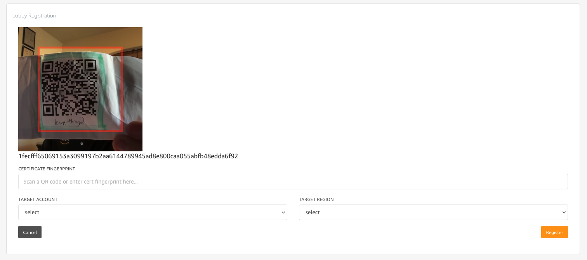

# Device Lobby Admin Console

## Deployment Quickstart Guide

0. Prerequisites

* Deployed Device Lobby Service with associated AppSync API and API key.


1. **From the Cloud9 deployment IDE you created (Device Lobby Deployment Env) in the previous steps, enter the admin-console directory and setup the Amplify build environment:**
```
cd admin-interface/admin-console/
nvm install 12.22.12
nvm use 12.22.12
npm install
npm install -g @aws-amplify/cli
```

2. **Initialize the Amplify project using the responses listed below when asked by the Amplify CLI:**
```
amplify init
```
  * Provide the below responses to the initialization questions:
> - ? Enter a name for the project **DLAdminConsole**
> - ? Initialize the project with the above configuration? **Y**
> - ? Select the authentication method you want to use: (Use arrow keys): **AWS profile**
> - ? Setup new user (Y/n) **Y**
> - Press Enter
> - ? region: **Select region where DL Admin Console will be deployed**
> - ? user name:  (amplify-XCNwm) **Press Enter to accept default**
> - Open the link provided to create the Amplify user in the IAM console and click **Next* until you reach the page showing the Access key ID and Secret access key.  Copy these values and return to the Cloud9 terminal.
> - ? accessKeyId: **Access Key ID from previous step**
> - ? secretAccessKey: **Secret Access Key from previous step**
> - ? Profile Name:  (default) **Press Enter**
> - ? Please choose the profile you want to use (Use arrow keys): default **Press Enter**

***Note: If you get an error that the security token is invalid, try running 'amplify init' again.  It can take a few minutes for the user to be created in IAM and the amplify cli can fail if the user was just created.

3. **Add the AppSync API ID that was generated when the Device Lobby service was deployed:**
```
aws appsync list-graphql-apis
```
Copy/paste the apiId into the following command to link the admin APIs to the admin console project: 
```
amplify add codegen --apiId <apiid-of-devicelobbyadminAPI>
```
  * Press Enter to accept the default values for each question prompt.

4. **Add Cognito based user authentication to the web app:**
```
amplify add auth
```
  * Provide the below responses to the add auth questions:
> - ? Do you want to use the default authentication and security configuration? **Default configuration**
> - ? How do you want users to be able to sign in? (Use arrow keys) **Email**
> - ? Do you want to configure advanced settings? (Use arrow keys) **No, I am done.**

5. **Add Amplify hosting of the web app:**
```
amplify add hosting
```
  * Provide the below responses to the add hosting questions:
> - ? Select the plugin module to execute …  (Use arrow keys or type to filter) **Hosting with Amplify Console**
> - ? Choose a type (Use arrow keys) **Manual deployment**

6. **Publish the project:**
```
amplify publish
```
> - ? Are you sure you want to continue? **Yes**  

This step with take a few minutes to build and publish the admin console.  When complete, you will see a message similar to the below with a public link to access the Device Lobby Admin Console:
```
✔ Zipping artifacts completed.
✔ Deployment complete!
https://dev.123456abcdef.amplifyapp.com
```

7. **Setup Amplify hosting rewrite rule for SPA:**

The Device Lobby Admin console web app is implemented using a single page web app (SPA) framework.  To prevent **Access Denied** errors in the browser([details here](https://docs.aws.amazon.com/amplify/latest/userguide/redirects.html#redirects-for-single-page-web-apps-spa)) when entering URL paths directly, please use the following commands in the Cloud9 terminal to look up your AmplifyAppID and configure a rewrite rule for Amplify hosting:
```
DLADMINAPPID=$(aws amplify list-apps --query 'apps[0].appId' --output text)
aws amplify update-app --app-id $DLADMINAPPID --custom-rules 'source="</^[^.]+$|\.(?!(css|gif|ico|jpg|js|png|txt|svg|woff|woff2|ttf|map|json|webp)$)([^.]+$)/>",target="/",status="200"'
```
***Note: If you have other Amplify Apps in your account, please modify the above command to use the Amplify App ID of the DL Admin Console app in the second command. 

8. **Create a user and log into the Device Lobby Admin Console:**

Open a browser window and go to the URL provided (ex. *`https://dev.123456abcdef.amplifyapp.com`*) when the app was published. Click on the "Create Account" link and create an account with your **email as your username**.  Complete the account activation with the verification code in the email sent to the user email address.

Verify you can log into the Device Lobby Admin Console with the newly created user.  Now you can start onboarding devices!


## Controlling access the Device Lobby Admin Console

A Cognito user pool provides authentication for users of the Device Lobby Admin Console.  From the Cognito service console in the AWS Console, you may create new users and change the configuration of auth requirements for the users of the service.


## Claiming / Registering devices




  nvm install 12.22.12
  nvm use 12.22.12
  npm install
  amplify init
    -project name
    -create amplify user for dep
  amplify add api
  amplify add codegen
    --enter all the way
  amplify add auth
    -by email
  amplify add hosting
    -enter all the way through
  amplify codegen
  amplify push
  amplify publish

  Go to amplify console and get the admin console URL.  This might take a minute to show up as the hosting environment is deployed.

  
  236  npm install
  237  npm install -g @aws-amplify/cli
  238  amplify init
  239  amplify add codegen --apiId 3m47xdmhq5bqvkjuszs64kiymu
  240  amplify codegen
  241  amplify add auth
  242  npm start
  243  amplify add hosting
  244  amplify publish
  
  
  Enrolling target accounts.
  1) User enters target account
  2) Under the hood of lobby account:
    Role: lobby_commissioner_role
    1) create a policy to assume role on target account
    
    {
        "Version": "2012-10-17",
        "Statement": {
            "Effect": "Allow",
            "Action": "sts:AssumeRole",
            "Resource": "arn:aws:iam::508606519000:role/lobby_commissioner_role"
        }
    }
    2) attach policy to role
    3) write target account pending to DDB
  3) downloads script for user to run in other account
  4) user runs script to:
    1) create “lobby_commissioner_role” with IoT permissions
    2) Edit trust relationship to enable commission lambda to assume it:
    
    {
      "Version": "2012-10-17",
      "Statement": [
        {
          "Effect": "Allow",
          "Principal": {
            "AWS": "arn:aws:iam::099064819889:role/lobby_commissioner_role"
          },
          "Action": "sts:AssumeRole",
          "Condition": {}
        }
      ]
    }
  5) user goes back to DL and clicks verify
  6) account verified by pulling IoT ep and is marked as active


  
